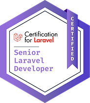

  

<h1 align="center">Hi, I'm Diovi Robinet Morales 👋</h1>

  <strong>Full Stack Developer</strong> | Building practical software with a focus on clean UX, performance, and maintainability.

  💻 Full Stack Developer | 🚀 Building useful products

  
  
  

  
  
  
  
  
  
  
  
  
  
  
  
  
  
  
  
  
  
  

<blockquote>
  
🔘 Developer focused on building reliable products, shipping fast, and keeping the codebase easy to understand.

</blockquote>

## 📑 Professional Summary

I’m a Software Engineer with over 6 years of experience, committed to constructing reliable and maintainable software. My work is
motivated by a respect for best practices and a dedication to crafting clean, efficient code. I enjoy acquiring knowledge and implementing
software architecture principles, design patterns, and Test-Driven Development (TDD) to generate thoughtful, lasting solutions. I am to keep
evolving as a developer, always striving to contribute positively to each project and team.

## 📑 Current Focus

- Web applications and full stack features
- Clean architecture and maintainable code
- Productive workflows with modern tooling

## 📑 Projects Focus

- <strong><a href="https://drm-multitabs-docs.netlify.app/">Component MultiTabs</a></strong> - A component for rendering fixed tabs in the style of web browsers, featuring drag-and-drop functionality, tab persistence, route-based navigation, and reload hooks for Vue, React, and Angular applications—without imposing a specific layout system.
- <strong><a href="https://drm-countries-flags.netlify.app/">Countries & Flags</a></strong> - A handy library for adding a component to Angular, React, and Vue showing a countries-and-flags selector with search, filtering, and fast browsing. Works with Angular Material, TailwindCSS, Bootstrap, PrimeNG, Vuetify, and shadcn/ui; flags come from the <code>flag-icons</code> package.

## 📑 Current Projects

- <strong><a href="https://github.com/drobinetm/testing_stripe_vite">Stripe Vite Template</a></strong> - Template tool for making high-quality FastAPI project with Stripe and Vite.
- <strong><a href="https://github.com/drobinetm/comercial_technical_project">Commercial Technical Project</a></strong> - Technical test for Laravel and Vue 3. Simple project with more solid concepts.
- <strong><a href="https://github.com/drobinetm/portfolios">Portfolios</a></strong> - Repository with diferents porfolios projects.
- <strong><a href="https://github.com/drobinetm/technical-tests">Technical Tests</a></strong> - Repository with diferents technical tests projects.
- <strong><a href="https://github.com/drobinetm/python-otp">Python OTP</a></strong> - Tool for generating OTPs with Python.
- <strong><a href="https://github.com/drobinetm/wp_custom_react-4p">WordPress Custom React 4P</a></strong> - Project template for WordPress with React 4P.
- <strong><a href="https://github.com/drobinetm/wp_docker_template">WordPress Docker Template</a></strong> - Project template for WordPress with Docker.
- <strong><a href="https://github.com/drobinetm/wp_custom_themes-4p">WordPress Custom Themes 4P</a></strong> - Project template for WordPress with React 4P.
- <strong><a href="https://github.com/drobinetm/odoo-rest-api">Odoo REST API</a></strong> - Module restapi modified to create api option in Odoo ERP.
- <strong><a href="https://github.com/drobinetm/okd-cluster-deploy">OKD Cluster Deploy</a></strong> - This project raises a local OKD 4.x cluster on Ubuntu with VirtualBox, Vagrant and Ansible.
- <strong><a href="https://github.com/drobinetm/python-recipes">Python Recipes</a></strong> - Different recipes for Python with code examples.
- <strong><a href="https://github.com/drobinetm/print-ai-microservices">Print AI Microservices</a></strong> - Technical test project developed with poetry.
- <strong><a href="https://github.com/drobinetm/wallet-digital-project">Wallet Digital Project</a></strong> - Wallet and Credit System.
- <strong><a href="https://github.com/drobinetm/permify-php-sdk">Permify PHP SDK</a></strong> - Simple SDK for Permify that provides a simple interface to interact with Permify.
- <strong><a href="https://github.com/drobinetm/python-telegram">Python Telegram</a></strong> - Simple Telegram bot developed with poetry.
- <strong><a href="https://github.com/drobinetm/laravel-drobinetm-wallet">Laravel Wallet</a></strong> - Laravel project for wallet economic.
- <strong><a href="https://github.com/drobinetm/drm-ng-countries-flags">Countries Flags Angular Library</a></strong> - Angular library to list the countries and their flags in a selection component.
- <strong><a href="https://github.com/drobinetm/drobinetm-finances">Drobinetm Finances</a></strong> - Small project to manage personal finances.
- <strong><a href="https://github.com/drobinetm/laravel-drobinetm-storage-logs">Laravel Storage Logs</a></strong> - Laravel package to store logs of storage.
- <strong><a href="https://github.com/drobinetm/laravel-drobinetm-voyager-blog">Laravel Voyager Blog</a></strong> - Laravel package to create blog in the project.
- <strong><a href="https://github.com/drobinetm/laravel-drobinetm-events">Laravel Events</a></strong> - Laravel package to store events of a project.
- <strong><a href="https://github.com/drobinetm/registry-commands">Registry Commands</a></strong> - Laravel package to store commands of a project.

## 📑Skills Summary

<table border="0" cellspacing="0" cellpadding="0">
  <tr>
    <td valign="top">
      <ul>
        <li>Cloud architecture and scalable system design</li>
        <li>Full stack development</li>
        <li>Database optimization and query performance tuning</li>
        <li>API design and integration</li>
        <li>Containerization and orchestration</li>
        <li>Microservices architecture development and maintenance</li>
        <li>Security-first development practices and compliance implementation</li>
        <li>Cross-platform application development</li>
        <li>Test-driven development and quality assurance</li>
        <li>Framework proficiency across languages</li>
        <li>Codebase refactoring and legacy systems modernization</li>
      </ul>
    </td>
    <td valign="top">
      <ul>
        <li>Serverless architecture and cloud functions implementation</li>
        <li>Data modeling and schema design</li>
        <li>Responsive and adaptive web design</li>
        <li>Static site generators and modern build tools</li>
        <li>Backend optimization for high-concurrency systems</li>
        <li>Authentication and authorization protocols</li>
        <li>DevOps automation for deployment and scaling</li>
        <li>Advanced debugging and issue resolution</li>
        <li>Event-driven architecture and asynchronous processing</li>
        <li>Data visualization and reporting tools integration</li>
        <li>Big data processing and analysis</li>
      </ul>
    </td>
  </tr>
</table>
